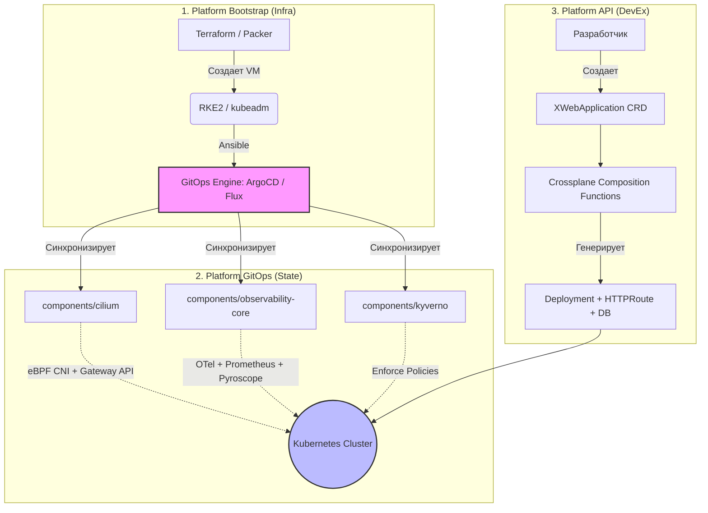

---

# 🚀 Kubernetes Platform Engineering Blueprint (2026 Gold Standard)

[](https://kubernetes.io/)
[](https://argoproj.github.io/)
[](https://slsa.dev/)
[](LICENSE)

Этот проект представляет собой эталонную архитектуру (Blueprint) для построения внутренней платформы разработчиков (Internal Developer Platform, IDP) на базе Kubernetes. 

Архитектура разработана с учетом лучших практик Platform Engineering 2026 года: строгое разделение ответственности, Supply Chain Security, декларативное управление через GitOps и предоставление разработчикам абстракций высокого уровня через Crossplane.

---

## 🏗 Архитектура платформы

Платформа разделена на три независимых репозитория для минимизации blast radius и разделения циклов разработки:



---

## ✨ Ключевые особенности

1. **Три репозитория**: Четкое разделение на `bootstrap` (инфраструктура), `gitops` (состояние кластера) и `api` (интерфейс для разработчиков).
2. **Драйверная модель GitOps**: Ansible-роль абстрагирована от конкретного движка. Переключение с ArgoCD на Flux или Fleet требует только изменения переменной `gitops.engine`.
3. **Supply Chain Security**: CI-пайплайн включает генерацию SBOM (Syft), сканирование уязвимостей (Grype/Trivy) и проверку организационных политик (Conftest/OPA).
4. **Чистый OCI**: Предпочтительная загрузка Helm-чартов напрямую из OCI-реестров (с поддержкой Sigstore/Cosign), с fallback на HTTPS при необходимости.
5. **Единый сетевой стек**: Cilium используется как CNI, eBPF Load Balancer (замена MetalLB), контроллер Gateway API и Hubble для наблюдаемости. *(MetalLB допускается как исключение для специфичных bare-metal сред).*
6. **4 сигнала наблюдаемости**: OpenTelemetry Collector агрегирует Метрики (Prometheus), Логи (Loki), Трейсы (Tempo) и Профилирование (Pyroscope). Grafana вынесена в отдельный компонент из-за требований к SSO/RBAC.
7. **Platform API без Go**: Использование Crossplane Composition Functions (Pipeline Mode) для генерации ресурсов. Кастомные Go-контроллеры создаются только в исключительных случаях сложной бизнес-логики.

---

## 📂 Структура репозиториев

### 1. `platform-bootstrap`
Содержит Ansible-код для начальной настройки кластера и установки GitOps-движка.
```text
├── ansible.cfg
├── requirements.yml
├── inventory/production/
│   ├── hosts.ini
│   └── group_vars/all.yml
├── playbooks/bootstrap.yml
└── roles/platform/gitops_engine/
    ├── tasks/main.yml       # Роутер драйверов
    ├── tasks/argocd.yml     # Логика для ArgoCD
    └── tasks/flux.yml       # Логика для Flux
```

### 2. `platform-gitops`
Декларативное состояние платформы. Управляется исключительно через GitOps-движок.
```text
├── .github/workflows/gitops-pr-checks.yaml  # Supply Chain Gate
├── .github/policies/                        # OPA/Conftest правила
├── bootstrap/root/appset-components.yaml    # Git Generator
├── components/                              # Базовые компоненты (Cilium, OTel, Kyverno)
├── clusters/                                # Multi-cluster конфигурации (prod-eu, dev)
```

### 3. `platform-api`
Интерфейс для разработчиков и композиции ресурсов.
```text
├── crds/xwebapplication.yaml                # Абстракция для разработчиков
└── compositions/webapp/function-pipeline.yaml # Crossplane Pipeline Mode
```

---

## 🚀 Быстрый старт (Quickstart)

### Предварительные требования
- Работающий кластер Kubernetes (`kubeadm` или `RKE2`).
- Установленные на управляющей машине: `ansible`, `python3`, `kubectl`.
- Доступ к кластеру через `kubeconfig` (по умолчанию: `/etc/rancher/rke2/rke2.yaml` или `~/.kube/config`).

### Шаг 1: Подготовка GitOps-репозитория
1. Создайте репозиторий `platform-gitops` в вашей организации.
2. Закоммитьте файлы из раздела `platform-gitops` в ветку `main`.
3. *(Рекомендуется)* Проверьте работу CI-пайплайна, создав тестовый Pull Request.

### Шаг 2: Настройка Ansible
В репозитории `platform-bootstrap` отредактируйте `inventory/production/group_vars/all.yml`:
```yaml
kubernetes:
  kubeconfig: ~/.kube/config # Укажите актуальный путь

gitops:
  engine: argocd
  version: "7.5.0"
  namespace: gitops-system
  repo_url: "https://github.com/your-org/platform-gitops.git" # Ваш репозиторий
  revision: "main"
```

### Шаг 3: Запуск Bootstrap
```bash
cd platform-bootstrap
pip install ansible kubernetes
ansible-galaxy collection install -r requirements.yml

# Dry-run (проверка)
ansible-playbook playbooks/bootstrap.yml --check

# Реальный запуск
ansible-playbook playbooks/bootstrap.yml
```

### Шаг 4: Валидация
1. Получите пароль администратора:
   ```bash
   kubectl -n gitops-system get secret argocd-initial-admin-secret -o jsonpath="{.data.password}" | base64 -d
   ```
2. Сделайте проброс порта: `kubectl port-forward svc/argocd-server -n gitops-system 8080:443`
3. Откройте `https://localhost:8080`. Вы увидите, как ArgoCD автоматически развернул компоненты из `components/`.
4. **Проверка политик**: Попробуйте создать манифест `kind: Ingress`. Kyverno должен заблокировать его с требованием использовать Gateway API (`HTTPRoute`).

---

## 👨‍💻 Опыт разработчика (Developer Experience)

Разработчикам не нужно знать о Deployment, Service, Ingress или HPA. Они взаимодействуют только с Platform API.

Пример запроса от разработчика (`webapp-claim.yaml`):
```yaml
apiVersion: platform.company.io/v1alpha1
kind: XWebApplication
metadata:
  name: my-awesome-app
spec:
  image: ghcr.io/myorg/myapp:v1.2.3 # Должен быть подписан Cosign
  domain: myapp.dev.company.com
  replicas: 3
```
После применения этого манифеста, Crossplane Composition Functions автоматически сгенерируют `Deployment`, `Service`, `HTTPRoute` и запросят базу данных, если это указано в спецификации.

---

## 🛡️ Безопасность и Compliance (Supply Chain Gate)

Каждый Pull Request в `platform-gitops` проходит автоматическую проверку:
1. **Syft**: Генерация SBOM (Software Bill of Materials) в формате SPDX.
2. **Grype**: Сканирование SBOM на наличие известных CVE.
3. **Trivy**: Статический анализ конфигураций Kubernetes и IaC.
4. **Conftest / OPA**: Проверка соблюдения организационных политик (например, запрет тега `latest`, требование использования только OCI-реестров).

---

## 📜 Architectural Decision Records (ADR)

| ID | Решение | Обоснование |
| :--- | :--- | :--- |
| **ADR-001** | Разделение на 3 репозитория | Минимизация blast radius. Инфраструктурная команда не должна ждать апп-команду для обновления политик Kyverno, и наоборот. |
| **ADR-002** | Драйверная модель GitOps в Ansible | Избегание `if/else` ада. Добавление нового движка (например, OCM) требует только создания нового файла `ocm.yml`, не меняя существующий код. |
| **ADR-003** | Cilium как предпочтительный стек | Объединение CNI, Load Balancer, Gateway API и Network Policy в один eBPF-стек снижает операционные издержки. *MetalLB остается допустимым fallback для строгих bare-metal сред.* |
| **ADR-004** | Вынос Grafana из observability-core | В enterprise-средах Grafana часто имеет независимый жизненный цикл, строгие требования к SSO (OIDC/SAML) и централизованному RBAC, которыми должна управлять отдельная команда. |
| **ADR-005** | Crossplane Functions вместо Go-контроллеров | Composition Functions (Pipeline Mode) покрывают 95% сценариев генерации ресурсов декларативно. Кастомный Go-код пишется только для сложной, недекларативной бизнес-логики. |

---

## 🤝 Вклад в проект (Contributing)

1. Форкните репозиторий.
2. Создайте ветку фичи (`git checkout -b feature/amazing-feature`).
3. Убедитесь, что `conftest` и `trivy` проходят локально.
4. Создайте Pull Request с подробным описанием изменений.

---

## 📄 Лицензия

Этот проект распространяется под лицензией MIT. См. файл [LICENSE](LICENSE) для подробностей.

---

> **Примечание**: Этот blueprint является живым документом. Архитектура будет эволюционировать вместе с экосистемой Kubernetes и лучшими практиками Platform Engineering.
